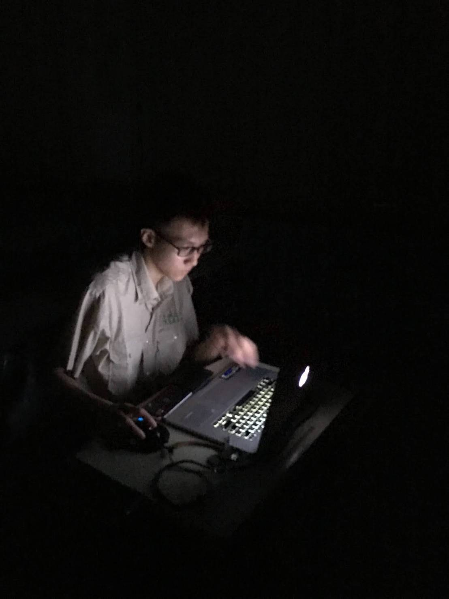

<title>賴資敏的個人網站</title>
<meta charset="UTF-8">
<meta name="viewport" content="width=device-width, initial-scale=1">
<link rel="stylesheet" href="https://www.w3schools.com/w3css/4/w3.css">
<link rel="stylesheet" href="https://fonts.googleapis.com/css?family=Lato">
<link rel="stylesheet" href="https://cdnjs.cloudflare.com/ajax/libs/font-awesome/4.7.0/css/font-awesome.min.css">
<link rel="stylesheet" type="text/css" href="BackgroundAnimation.css">

<body>

<!-- Navbar (sit on top) -->

  

    <a class="w3-bar-item w3-button w3-hover-black w3-hide-medium w3-hide-large w3-right" href="javascript:void(0);" onclick="toggleFunction()" title="Toggle Navigation Menu">
      <i class="fa fa-bars"></i>
    </a>
    

      <a href="#home" class="w3-bar-item NavBar_Item Neumorphism TabletHide">主頁</a>
      <a href="#about" class="w3-bar-item NavBar_Item Neumorphism TabletHide"><i class="fa fa-user"></i>關於我</a>
      <a href="#works" class="w3-bar-item NavBar_Item Neumorphism TabletHide"><i class="fa fa-th"></i>工作/教學</a>
      <a href="#certifications" class="w3-bar-item NavBar_Item Neumorphism TabletHide"><i class="fa fa-envelope"></i>作品集</a>
     
      <a href="#" class="w3-bar-item w3-hide-small w3-right NavBar_Item Neumorphism TabletHide">
        <i class="fa fa-search NavBar_Item">Search</i>
      </a>
      <a href="https://github.com/XiaNight" class="w3-bar-item w3-hide-small w3-right NavBar_Item Neumorphism TabletHide">
        <i class="fa fa-github NavBar_Item">Github</i>
      </a>
      <a href="download.php?path=賴資敏的簡歷.pdf" class="w3-bar-item w3-hide-small w3-right NavBar_Item Neumorphism TabletHide">
        <i class="fa fa-file NavBar_Item">下載簡歷</i>
      </a>
    

  

  <!-- Navbar on small screens -->
  

    <a href="#about" class="w3-bar-item w3-button" onclick="toggleFunction()">關於我</a>
    <a href="#works" class="w3-bar-item w3-button" onclick="toggleFunction()">工作/教學</a>
    <a href="#certifications" class="w3-bar-item w3-button" onclick="toggleFunction()">作品集</a>
    <a href="#" class="w3-bar-item w3-button">SEARCH</a>
  

<!-- First Parallax Image with Logo Text -->

  

      
賴資敏的個人網站

      
<i class="fa fa-user fa-fw w3-margin-right w3-large w3-text-black"></i>賴資敏

      
<i class="fa fa-graduation-cap fa-fw w3-margin-right w3-large w3-text-black"></i>東海大學三年級

      
<i class="fa fa-server fa-fw w3-margin-right w3-large w3-text-black"></i>資訊工程學系軟體工程組

      
<i class="fa fa-home fa-fw w3-margin-right w3-large w3-text-black"></i>新北市林口區

      
<i class="fa fa-envelope fa-fw w3-margin-right w3-large w3-text-black"></i>summernight2001519@gmail.com

      
<i class="fa fa-phone fa-fw w3-margin-right w3-large w3-text-black"></i>0987-750-217

  

<!-- Container (About Section) -->

  <h3 class="w3-center Neumorphism">ABOUT ME</h3>
  
<em>寫程式是我的興趣，我的休閒娛樂</em>

  
&emsp;&emsp;
      我的興趣是<b>寫程式</b>，學習<b>新技術</b>，通常都是在網路上自己查資料，找YouTube教學，我非常喜歡<b>自學</b>，因為我覺的我能掌握我要學習的技術，而且網路上的資訊一直都在更新，不會與社會脫節。除了寫程式，我還喜歡去學習其他領域的技術，像是<b>3D繪圖</b>，<b>數位材質製作</b>，<b>木工</b>等，再結合高中時在<b>電子科</b>中學到的技術，像是<b>電子電路</b>，<b>邏輯設計</b>，<b>焊接</b>等，<b>軟體硬體</b>都有<b>實做</b>能力，這些能力的結合讓我在<b>專題製作</b>時作為非常<b>重要</b>的角色。不管是高中還是大學的作業，我都會以我能達到的<b>最高水準</b>去製作，<b>編寫程式</b>，盡量讓教授能看到我的能力，同時也能學習<b>新的能力</b>，<b>累積經驗</b>，找出我不擅長的部份去<b>加強</b>。
  

  
&emsp;&emsp;
    我從高二開始寫<b>Unity</b>，通常會在Unity上進行<b>創作小遊戲</b>，在寫遊戲的同時，<b>增進</b>自己寫程式的能力。除了<b>自學</b>，我非常樂把我在網路上蒐集的資料與<b>知識分享</b>給大家，讓我覺得我可以開始做<b>Unity</b>的<b>入門教學</b>，希望大家可以對<b>遊戲產業</b>有<b>興趣</b>，並更加認識每天都在玩的遊戲是<b>如何製作</b>出來的。
  

  
  

    

      
<b><i class="fa fa-user w3-margin-right"></i>賴資敏</b>
 
      
      
    

    <!-- Hide this text on small devices -->
    

      

        在我就讀國中時，發現自己對數學有很高的理解力，理解公式並知道如何應用；再加上選擇了程式設計社團，讓我有機會接觸程式語言，發現我對程式設計非常有興趣，以高階程式語言Scratch寫出了許多小遊戲，並在國中二年級時獲得的參加全國Scratch程式設計比賽，獲得了全北區第三名的成績，補習班主任發現我非常有寫程式的天賦，特別一對一教授我有關Arduino的使用與應用、多種模組的使用方法，又介紹了Sololearn與CodeAcademy這兩個程式教學網站，讓我可以在家自己學習。
      

      

        寫程式是我的休閒娛樂，通常寫小遊戲當作練習。我使用Unity遊戲引擎使用C#程式語言撰寫，是我覺得寫遊戲最方便最快速的遊戲引擎，不僅可以練習與精進寫程式的技巧，還可以與同學分享我寫的小遊戲。但不止是只有Unity與C#，我還會用Eclipse程式編譯python程式，搭配pygame模組寫遊戲。
      

    

  

  
I'm really good at:

  

    
<i class="fa fa-laptop"></i>程式設計

    

      
90%

    

  

  

    
<i class="fa fa-microchip"></i>電路設計

    

      
80%

    

  

  

    
<i class="fa fa-gamepad"></i>數位遊戲製作

    

      
85%

    

  

  

    11+ 
    Partners
  

  

    20+ 
    Projects Done
  

  

    9+ 
    Computer Science Develope Experience
  

<!-- Second Parallax Image with Portfolio Text -->

  

    工作／教學經驗
  

<!-- Container (Portfolio Section) -->

  
    <h5 class=""><b>硬體工程師 / <a href="https://r-dap.com">r-dap.com</a></b></h5>
    <h6 class="w3-text-white">
      <i class="fa fa-calendar"></i>
      2021 - 至今
    </h6>
    

    
為團隊中主要技術人員，負責電路設計、4G通訊、全球定位、電源供應等硬體相關設計與製作，輔助前端工程師優化軟體程式碼。

  
  
    <h5 class=""><b>獨立數位遊戲製作</b></h5>
    <h6 class="w3-text-white">
      <i class="fa fa-calendar"></i>
      2018 - 至今
    </h6>
    

    
製作數位遊戲一直以來都是我的興趣，在空閒時間設計出心中的理想遊戲，過程中可提升程式能力與3D模型設計能力，對於我的程式技術有非常大的幫助。

  
  
    <h5 class=""><b>遠端程式家教</b></h5>
    <h6 class="w3-text-white">
      <i class="fa fa-calendar"></i>
      2020 - 至今
    </h6>
    

    
於各大家教社群提供資訊與教學內容，主要提供解題方案，可解Python, Java, C#...等程式相關問題，並提供線上教程，使學生能真正理解題目用意與相關應用。

  
  
    <h5 class=""><b>數位遊戲研究創作社/教學長</b></h5>
    <h6 class="w3-text-white">
      <i class="fa fa-calendar"></i>
      2020 - 2021
    </h6>
    

    
在社團中擔任主要Unity教師，教導同學如何使用Unity製作遊戲，包括前端UI/UX、3D特效、C#程式、動畫、燈光控制、材質設計、遊戲邏輯等教學課程。

  

<!-- Modal for full size images on click-->

  <i class="fa fa-remove"></i>
  

    
    

  

<!-- Third Parallax Image with Portfolio Text -->

  

     證照/證書
  

  
    <h5 class=""><b>國家證照</b></h5>
    <ul  style="text-align: left;">
      <li><h6 class="w3-text-white">工業電子丙級</h6></li>
      <li><h6 class="w3-text-white">數位電子乙級</h6></li>
    </ul>
  
  
    <h5 class=""><b>考試</b></h5>
    <ul  style="text-align: left;">
      <li><h6 class="w3-text-white">CPE(3題|1,2,5)</h6></li>
    </ul>
  
  
    <h5 class=""><b>程式語言</b></h5>
    <ul  style="text-align: left;">
      <li><h6 class="w3-text-white">Python</h6></li>
      <li><h6 class="w3-text-white">Dart</h6></li>
      <li><h6 class="w3-text-white">C#</h6></li>
      <li><h6 class="w3-text-white">Java</h6></li>
      <li><h6 class="w3-text-white">HTML</h6></li>
      <li><h6 class="w3-text-white">CSS</h6></li>
      <li><h6 class="w3-text-white">JavaScript</h6></li>
      <li><h6 class="w3-text-white">PHP</h6></li>
      <li><h6 class="w3-text-white">C++</h6></li>
      <li><h6 class="w3-text-white">C</h6></li>
    </ul>
  
  
    <h5 class=""><b>生產技術</b></h5>
    <ul  style="text-align: left;">
      <li><h6 class="w3-text-white">Unity數位遊戲設計</h6></li>
      <li><h6 class="w3-text-white">Altium Designer電路設計</h6></li>
      <li><h6 class="w3-text-white">Blender3D設計圖</h6></li>
      <li><h6 class="w3-text-white">SketchUp3D設計圖</h6></li>
      <li><h6 class="w3-text-white">Fusion 3603D工業設計</h6></li>
      <li><h6 class="w3-text-white">Final Cut Pro影片剪輯</h6></li>
      <li><h6 class="w3-text-white">Arduino電路開發板</h6></li>
      <li><h6 class="w3-text-white">雷射切割</h6></li>
      <li><h6 class="w3-text-white">木材加工</h6></li>
    </ul>
  

<!-- Container (Contact Section) -->

  <h3 class="w3-center">更多資訊</h3>
  <!-- 
<em>I'd love your feedback!</em>
 -->

  

    

      <!--  -->
    

    

      

        <i class="fa fa-map-marker fa-fw w3-hover-text-black w3-xlarge w3-margin-right"></i> 東海大學  
        <i class="fa fa-phone fa-fw w3-hover-text-black w3-xlarge w3-margin-right"></i> Phone: 0987750217 
        <i class="fa fa-envelope fa-fw w3-hover-text-black w3-xlarge w3-margin-right"></i> Email: summernight2001519@gmail.com 
      

      <!-- 
Swing by for a cup of <i class="fa fa-coffee"></i>, or leave me a note:
 -->
      <!-- <form action="/action_page.php" target="_blank">
        

          

            <input class="w3-input w3-border" type="text" placeholder="Name" required name="Name">
          

          

            <input class="w3-input w3-border" type="text" placeholder="Email" required name="Email">
          

        

        <input class="w3-input w3-border" type="text" placeholder="Message" required name="Message">
        <button class="w3-button w3-black w3-right w3-section" type="submit">
          <i class="fa fa-paper-plane"></i> SEND MESSAGE
        </button>
      </form> -->
    

  

<!-- Footer -->
<footer class="w3-center w3-black w3-padding-64 w3-opacity w3-hover-opacity-off">
  <a href="#home" class="w3-button w3-light-grey"><i class="fa fa-arrow-up w3-margin-right"></i>To the top</a>
  <!-- 

    <i class="fa fa-facebook-official w3-hover-opacity"></i>
    <i class="fa fa-instagram w3-hover-opacity"></i>
    <i class="fa fa-snapchat w3-hover-opacity"></i>
    <i class="fa fa-pinterest-p w3-hover-opacity"></i>
    <i class="fa fa-twitter w3-hover-opacity"></i>
    <i class="fa fa-linkedin w3-hover-opacity"></i>
  
 -->
  
Powered by <a href="https://www.w3schools.com/w3css/default.asp" title="W3.CSS" target="_blank" class="w3-hover-text-green">w3.css</a>

</footer>
 

</body>